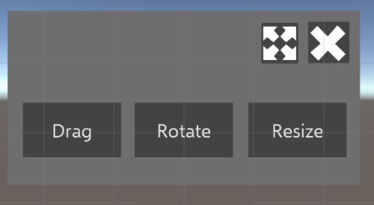

 # tp-uiux
Telepresense framework  UI/UX  

# Main UI
 
- MoveUI Button : Not Functional
- Drag Button : If you hold and drag this button, MainUI panel will move along with drag movement.
- CloseUI Button : Close MainUI panel
- Rain Start : Initiate rain particles
- Open Inventory : Open item inventory
- Item Deselect Button : Clear select item list
- Measure World : Activate measure function

- Virtual Hole : Select Virtual Hole item.
- Cube : Select Cube item.
- Close Inven : Close item inventory. 

# Hand Tracking UI
 
- Tracking hand movement
- Show to user text mesh which user item selected

# Object Edit Pop Up
 
- Drag Button : Make drag to selected object
- Rotate Button : Make rotate to selected object
- Resize Button : Make resize to selected object
- Diagonal Arrow Button : Drag "Object Edit Popup" panel
- X Button : Close Popup and reactivate object gravity affect.

# Cube
 
- If user tap this cube object, gravity affect will instantly deactivated and open Object Edit Popup Panel.

# Virtual Hole
 
- Create Virtual Hole at spatial rendered surface.

# Sphere Button
 
- If MainUI panel closed, user can reopen MainUI panel using this button.
- This button keep follows user.

# How to instatiate object
1. Open MainUI Panel
2. Open item inventory
3. Select item type
4. Tap any real world place
